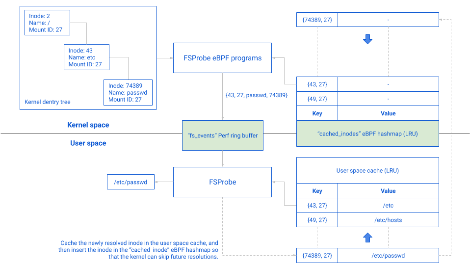

## FSProbe

FSProbe is a file system events notifier based on eBPF. Instead of hooking at the syscall level (like other eBPF solutions: [opensnoop](https://github.com/iovisor/bcc/blob/master/tools/opensnoop.py), [Falco](https://github.com/falcosecurity/falco), ...), FSProbe works by listening for events at the VFS level. Paths are resolved at runtime by going through the `dentry` tree up to the mount point of the filesystem. One of the main advantages of this solution is that the paths provided by FSProbe are absolute and resolved, while a syscall based strategy would only export syscall parameters (and thus potentially attacker controlled data).

### Requirements

- golang 1.13+
- This project was built on a Linux Kernel 5.3 and should be compatible with Kernels 5.0+.
- Kernel headers are expected to be installed in `lib/modules/$(uname -r)`, update the `Makefile` with their location otherwise.
- clang & llvm (version 8.0.1)

### Getting Started

1) If you need to rebuild the eBPF programs, use the following command:

```shell script
make build-ebpf
```

2) To build FSProbe, run:

```shell script
make build
```

3) To install FSProbe (copy to /usr/bin/fsprobe) run:
```shell script
make install
```

4) FSProbe needs to run as root. Run `sudo fsprobe -h` to get help.

```shell script
# ~ ./bin/fsprobe -h
FSProbe is a file system events notifier based on eBPF

FSProbe relies on eBPF to capture file system events on dentry kernel structures.
More information about the project can be found on github: https://github.com/Gui774ume/fsprobe

Usage:
  fsprobe [paths] [flags]

Examples:
sudo fsprobe /tmp

Flags:
  -s, --chan-size int                   User space channel size (default 1000)
      --dentry-resolution-mode string   In-kernel dentry resolution mode. Can be either "fragments",
                                        "single_fragment" or "perf_buffer" (default "perf_buffer")
  -e, --event string                    Listens for specific event(s) only. This option can be specified
                                        more than once. If omitted, all the events will be activated except the modify one.
                                        Available options: open, mkdir, link, rename, setattr, unlink,
                                        rmdir, modify (default "[]")
      --follow                          When activated, FSProbe will keep watching the files that were
                                        initially in a watched directory and were moved to a location
                                        that is not necessarily watched. In other words, files are followed
                                        even after a move (default true)
  -f, --format string                   Defines the output format.
                                        Options are: table, json, none (default "table")
  -h, --help                            help for fsprobe
  -o, --output string                   Outputs events to the provided file rather than
                                        stdout
      --paths-filtering                 When activated, FSProbe will only notify events on the paths
                                        provided to the Watch function. When deactivated, FSProbe
                                        will notify events on the entire file system (default true)
      --perf-buffer-size int            Perf ring buffer size for kernel-space to user-space
                                        communication (default 128)
  -r, --recursive                       Watches all subdirectories of any directory passed as argument.
                                        Watches will be set up recursively to an unlimited depth.
                                        Symbolic links are not traversed. Newly created subdirectories
                                        will also be watched. When this option is not provided, only
                                        the immediate children of a provided directory are watched (default true)
```

### Dentry resolution mode

FSProbe can be configured to use one of 3 different `dentry` resolution modes. A performance benchmark can be found below to understand the overhead of each solution in kernel space and user space. All three methods are implemented in [dentry.h](ebpf/dentry.h).

#### Fragments

##### Architecture


##### Cache

The `path_fragments` hashmap is used as an in-kernel cache. This means that the dentry resolver will not always insert a fragment if it is already present. Similarly, the dentry resolution will stop as soon as a path is found in cache.

#### Single Fragment

##### Architecture


##### Cache

Just like `path_fragments`, `single_fragments` is used as an in-kernel cache. If an inode has already been resolved it will not be resolved a second time. 

#### Perf buffer

##### Architecture



##### Cache

This method relies on a user space cache and the `cached_inodes` eBPF hashmap to decide where the in-kernel resolution should stop. Since the `cached_inodes` map is queried on each parent of a file, the resolution can stop right in the middle, in which case the event sent back to user space will only contain the missing part. For example, on the graph below, `/etc` was in the cache but the `passwd` file was not; the event sent on the ring buffer contains the missing part of the path (`passwd`) and the inode & mount ID of the cached prefix (`{43, 27}`). In order to avoid resolving `passwd` again, a new entry in both the user space cache and the `cached_inodes` eBPF hashmap are added (see the doted lines).

#### Benchmark

##### Important metrics

Each resolution method described above has its strengths and its weaknesses. Depending on the use case, choosing the right resolution method might yield better performances. We based our benchmark on 3 important metrics:

- **The in-kernel execution overhead**: as the dentry resolution happens within FSProbe's eBPF programs, a captured FS syscall will only return once the path has been resolved. The faster our eBPF programs are, the smaller the runtime overhead and delay will be for the applications in production. This overhead is measured in nanosecond per operation (ns/op), where an "operation" is made of an `Open` and a `Close` syscall.
- **The user space CPU & memory usage**: bringing a stream of events back to user space has serious performance implications on FSProbe's user space program. The more resource FSProbe needs to bring those events back, the less resource will be available for the rest of the host. This overhead is measured in bytes per operation (B/op), where the calculated amount of bytes is the total amount of memory that was allocated to bring 1 event back to user space. Although this doesn't produce any metric on the CPU per se, allocating memory and copying data put a lot of pressure on the CPU, and are the main consumers of CPU resources (since the benchmark doesn't do anything once an event is brought back).
- **The maximum events rate sustained over 10 seconds**: one of the biggest concerns with a monitoring tool based on eBPF & perf ring buffers is for the kernel to drop some events because the  buffers are full. This metric is important to determine the maximum rate of events per second above which events will be dropped.

##### Benchmark parameters 

We quickly realized that only 3 parameters have a real impact on the usage of resources:

- The depths of the paths that are being watched.
- The total number of nodes that are being watched (a node designates a folder or a file).
- The size of the perf ring buffer `fs_events`, used to send events back to user space.

Based on this observation, we decided that all our benchmarks would use the following parameters:

- All the paths used for the benchmark will be made of nodes of identical size: 10 randomly generated letters or numbers.
- All the user space channels will have a buffer of 1,000 entries.
- Each benchmark will be done with `b.N` set to 120,000 iterations.
- The paths generator will randomly choose a file to open in the pool of generated paths, at each iteration.
- The paths generator will generate paths with constant depths: there can only be one child folder per folder and only the last folder contains one or multiple files.
- In-kernel caches will be set to 40,000 entries for each method, and the inodes filter will be set to allow up to 120,000 inodes.

Finally, we ran the benchmark through 6 scenarios:

1) `depths = 10 / breadth = 1 / file_count = 1`
2) `depths = 60 / breadth = 1 / file_count = 1`
3) `depths = 10 / breadth = 1 / file_count = 120,000` (all 120,000 files are in the same leaf folder)
4) `depths = 10 / breadth = 4,000 / file_count = 80,000` (2 files per leaf folder)
5) `depths = 60 / breadth = 1,000 / file_count = 60,000` (1 file per leaf folder)
6) `depths = 5 / breadth = 8,000 / file_count = 80,000` (2 files per leaf folder)

For each scenario we retried the benchmark with a different perf rin buffer size. We tested the following sizes: [8, 16, 32, 64, 128, 256, 512, 1024, 2048, 4096].

##### Results

The entire output of the benchmark is available [here](documentation/FSProbe%20benchmark.pdf), the following table contains only the high level output:

| scenario | fragments | single_fragment | perf_buffer |
| :---: | :--- | :--- | :--- |
| 1 | **Best ns/op**: next is 10% slower (**Evt drop limit**: 256) | **Best ns/op**: next is 10% slower (**Evt drop limit**: 2048) | **Lowest B/op**: others are 100% - 400% higher (**Evt drop limit**: 64) |
| 2 | **Best ns/op**: next is 5% slower (**Evt drop limit**: 256) | **Second best ns/op**: next is 20% slower (**Evt drop limit**: 512) | **Lowest B/op**: others are 500% - 1,000% higher (**Evt drop limit**: 32) |
| 3 | **Best ns/op**: next is 9% slower (**Evt drop limit**: 1024) | **Evt drop limit**: 2048 | **Second best ns/op**: next is 30% slower. **Lowest B/op**: others are 250% - 450% higher (**Evt drop limit**: 64) |
| 4 | **Evt drop limit**: 128 | **Evt drop limit**: 2048 | **Best ns/op**: others are 30% - 55% slower. **Lowest B/op**: others are 300% - 400% higher (**Evt drop limit**: 64) |
| 5 | **Best ns/op**: next is 30% slower. **Lowest B/op**: others are 63% higher (**Evt drop limit**: 512) | **Evt drop limit**: 2048 | **Second best ns/op**: next is 20% slower. **Second lowest B/op**: next is 325% higher (**Evt drop limit**: 32) |
| 6 | **Evt drop limit**: 128 | **Best ns/op**: next is 6% slower (**Evt drop limit**: 1024) | **Second best ns/op**: next is 1% slower. **Lowest B/op**: others are 300% - 350% higher (**Evt drop limit**: 64) |

Based on this benchmark the `perf_buffer` method seems to be the most memory efficient one in most situations. Although its in-kernel overhead is not always the best, this method has such a lower memory footprint that we argue that the tradeoff is worth it. You will find below the output of the benchmark for the `perf_buffer` method, and for the scenario number 6 (we consider this scenario to be the most interesting one since it puts a lot of pressure on the caches).


The last part of the benchmark is about the maximum sustainable rates of events per second. The following results were calculated for the parameters used in scenario 6. It is worth noting that the `single_fragment` method was unable to complete the benchmark, as it kept dropping events.


### Capabilities Matrix

| Feature | [Inotify](https://www.man7.org/linux/man-pages/man7/inotify.7.html) | [FSProbe](https://github.com/Gui774ume/fsprobe) | [Opensnoop](https://github.com/iovisor/bcc/blob/master/tools/opensnoop.py) | [Perf](http://www.brendangregg.com/perf.html) | [Falco](https://github.com/falcosecurity/falco)
| --- | :---: | :--- | :---: | :--- | :---: |
| Process context | :x: | :white_check_mark: | :white_check_mark: | :white_check_mark: | :white_check_mark: |
| User / Group context | :x: | :white_check_mark: | :white_check_mark: | :white_check_mark: | :white_check_mark: |
| Recursive feature | :x: | :white_check_mark: | :white_check_mark: | :white_check_mark: | :white_check_mark: |
| Resolved paths | :white_check_mark: | :white_check_mark: (max depth: 70) | :x: | :white_check_mark: (max depth: 9) | :x: |
| Absolute paths | :white_check_mark: | :white_check_mark: (max depth: 70) | :x: | :white_check_mark: (max depth: 9) | :x: |
| Inode context | :x: | :white_check_mark: | :x: | :white_check_mark: | :x: |
| Mount point context | :x: | :white_check_mark: | :x: | :white_check_mark: | :x: |
| In-kernel filtering | :white_check_mark: | :white_check_mark: | :x: | :x: | :x: |
| Container context | :x: | :x: (not implemented yet) | :x: | :x: | :white_check_mark: |
| Follow files after move | :x: | :white_check_mark: | :x: | :x: | :x: |

### Known issues

- Depending on the activated events the cache might get corrupted after removes / unlinks / rmdir.
- Paths are resolved up to the root of each mountpoint.

### Future work

- Support for [CO-RE](https://facebookmicrosites.github.io/bpf/blog/2020/02/19/bpf-portability-and-co-re.html) will be added shortly so that eBPF compilation won't be needed anymore.
- Mount point resolution in order to support containers.

### Real world example

The [Datadog agent](https://github.com/DataDog/datadog-agent/tree/52cb2185d7188d965078ecf0a8c04db228374525/pkg/security) is currently using an improved version of the `fragments` method (with less overhead and better cache handling).
